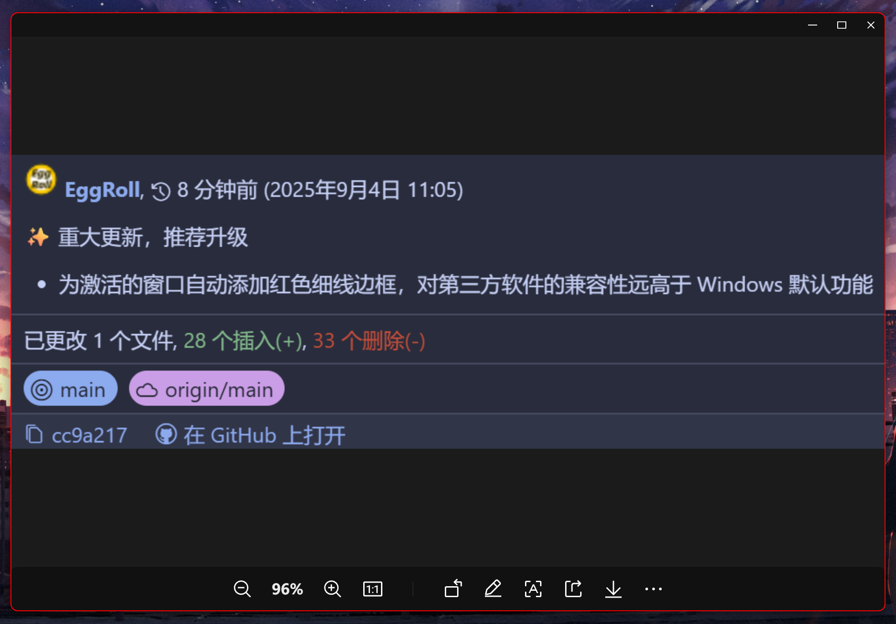

## 仓库链接

<https://github.com/Jy-EggRoll/my-keymap/>

## 使用方法

将本仓库中 `data` 目录中各子文件放入 MyKeymap 的 `data` 目录下即可，之后各个函数可以根据您的需要被 MyKeymap 调用。

> [!WARNING]
>
> 如果您不希望自己的设置被覆盖为我的设置，请勿替换 `config.json` 文件。

`custom_function.ahk` 仅保留和官方一样的接口，负责导入我的各个模块，本身不提供任何实际功能，所以如果希望体验全部功能，请加入全部的 ahk 文件。

## 引言

使用 [MyKeymap](https://github.com/xianyukang/MyKeymap) 已经有相当长一段时间了，学习了一部分 [AutoHotkey](https://github.com/AutoHotkey/AutoHotkey) 后，我也能独立编写一些脚本了。目前，这些脚本大都无需搭配 MyKeymap，可以直接由 AHK 调用。

值得注意的是，通过 MyKeymap 的强大扩展能力来使用我的函数是最佳实践。我的所有函数均未分配快捷键，若您需要直接通过 AHK 调用，请自行修改代码分配快捷键。

## 自定义函数表

> [!TIP]
>
> 若您在 GitHub 浏览此节，由于 GitHub 不支持自定义 CSS 的表格，为了更舒适的阅读体验，请跳转至我的博客查看函数表。文章剩余部分也是一致的，您可以直接继续浏览全文。

<https://eggroll.pages.dev/p/%E9%A1%B9%E7%9B%AE%E4%BB%8B%E7%BB%8Dmy-keymap/#%E8%87%AA%E5%AE%9A%E4%B9%89%E5%87%BD%E6%95%B0%E8%A1%A8>

<table style="width: 100%; border-collapse: collapse; table-layout: fixed;">
  <thead>
    <tr>
      <th style="width: 25%; padding: 10px; border: 2px solid; text-align: center;">函数名</th>
      <th style="width: 25%; padding: 10px; border: 2px solid; text-align: center;">参数说明</th>
      <th style="width: 25%; padding: 10px; border: 2px solid; text-align: center;">功能</th>
      <th style="width: 25%; padding: 10px; border: 2px solid; text-align: center;">最佳实践</th>
    </tr>
  </thead>
  <tbody>
    <tr>
      <td style="padding: 10px; border: 2px solid; overflow-wrap: anywhere;">DragWindow()</td>
      <td style="padding: 10px; border: 2px solid; overflow-wrap: anywhere;">无参数</td>
      <td style="padding: 10px; border: 2px solid; overflow-wrap: anywhere;">直接拖动任意非最大化窗口（无需点击标题栏）</td>
      <td style="padding: 10px; border: 2px solid; overflow-wrap: anywhere;">绑定到前置键+鼠标左键，例如 <kbd>Caps</kbd> + 鼠标左键</td>
    </tr>
    <tr>
      <td style="padding: 10px; border: 2px solid; overflow-wrap: anywhere;">ResizeWindow()</td>
      <td style="padding: 10px; border: 2px solid; overflow-wrap: anywhere;">无参数</td>
      <td style="padding: 10px; border: 2px solid; overflow-wrap: anywhere;">直接调整任意非最大化窗口的大小（无需定位到边框），窗口会被划分为 9 个区域，拖动对应区域即可完成调节，上手一试便知</td>
      <td style="padding: 10px; border: 2px solid; overflow-wrap: anywhere;">绑定到前置键+鼠标右键，例如 <kbd>Caps</kbd> + 鼠标右键</td>
    </tr>
    <tr>
      <td style="padding: 10px; border: 2px solid; overflow-wrap: anywhere;">PerCenterAndResizeWindow(percentageW, percentageH)</td>
      <td style="padding: 10px; border: 2px solid; overflow-wrap: anywhere;">小数，宽度占屏幕的比例（0-1），高度占屏幕的比例（0-1）</td>
      <td style="padding: 10px; border: 2px solid; overflow-wrap: anywhere;">调整窗口大小并居中，智能适应不同分辨率屏幕的不同缩放系数</td>
      <td style="padding: 10px; border: 2px solid; overflow-wrap: anywhere;">自定义快捷键</td>
    </tr>
    <tr>
      <td style="padding: 10px; border: 2px solid; overflow-wrap: anywhere;">Per*AndResizeWindow(percentageW, percentageH)</td>
      <td style="padding: 10px; border: 2px solid; overflow-wrap: anywhere;">小数，宽度占屏幕的比例（0-1），高度占屏幕的比例（0-1）</td>
      <td style="padding: 10px; border: 2px solid; overflow-wrap: anywhere;">* 替换为 Left、Down、Right、Up、LeftUp、LeftDown、RightUp、RightDown，负责分屏和边角</td>
      <td style="padding: 10px; border: 2px solid; overflow-wrap: anywhere;">前四个功能完全替换默认的 <kbd>Win</kbd> + 方向键，后四个替换为合适的快捷键</td>
    </tr>
    <tr>
      <td style="padding: 10px; border: 2px solid; overflow-wrap: anywhere;">AutoActivateWindow()</td>
      <td style="padding: 10px; border: 2px solid; overflow-wrap: anywhere;">无参数</td>
      <td style="padding: 10px; border: 2px solid; overflow-wrap: anywhere;">开关函数，未启动时调用则启动，已启动调用则停止，默认随 MyKeymap 启动</td>
      <td style="padding: 10px; border: 2px solid; overflow-wrap: anywhere;">绑定一个快捷键或一个指令，方便随时启停</td>
    </tr>
    <tr>
      <td style="padding: 10px; border: 2px solid; overflow-wrap: anywhere;">IncBrightness(dealt)</td>
      <td style="padding: 10px; border: 2px solid; overflow-wrap: anywhere;">整数，一个百分比值，如 5</td>
      <td style="padding: 10px; border: 2px solid; overflow-wrap: anywhere;">增加屏幕亮度，默认为 1 号显示器，每次 MyKeymap 启动重置为 1 号显示器</td>
      <td style="padding: 10px; border: 2px solid; overflow-wrap: anywhere;">自定义为合适的快捷键或指令</td>
    </tr>
    <tr>
      <td style="padding: 10px; border: 2px solid; overflow-wrap: anywhere;">DecBrightness(dealt)</td>
      <td style="padding: 10px; border: 2px solid; overflow-wrap: anywhere;">整数，一个百分比值，如 5</td>
      <td style="padding: 10px; border: 2px solid; overflow-wrap: anywhere;">降低屏幕亮度，默认为 1 号显示器，每次 MyKeymap 启动重置为 1 号显示器</td>
      <td style="padding: 10px; border: 2px solid; overflow-wrap: anywhere;">自定义为合适的快捷键或指令</td>
    </tr>
    <tr>
      <td style="padding: 10px; border: 2px solid; overflow-wrap: anywhere;">NextMonitor()</td>
      <td style="padding: 10px; border: 2px solid; overflow-wrap: anywhere;">无参数</td>
      <td style="padding: 10px; border: 2px solid; overflow-wrap: anywhere;">调整下一个显示器的亮度，只要 MyKeymap 不重启，当前被调节的显示器就不会再改变，直到触发该函数</td>
      <td style="padding: 10px; border: 2px solid; overflow-wrap: anywhere;">自定义为合适的快捷键或指令</td>
    </tr>
    <tr>
      <td style="padding: 10px; border: 2px solid; overflow-wrap: anywhere;">PreviousMonitor()</td>
      <td style="padding: 10px; border: 2px solid; overflow-wrap: anywhere;">无参数</td>
      <td style="padding: 10px; border: 2px solid; overflow-wrap: anywhere;">调整上一个显示器的亮度，只要 MyKeymap 不重启，当前被调节的显示器就不会再改变，直到触发该函数</td>
      <td style="padding: 10px; border: 2px solid; overflow-wrap: anywhere;">自定义为合适的快捷键或指令</td>
    </tr>
    <tr>
      <td style="padding: 10px; border: 2px solid; overflow-wrap: anywhere;">AutoWindowColorBorder()</td>
      <td style="padding: 10px; border: 2px solid; overflow-wrap: anywhere;">无参数</td>
      <td style="padding: 10px; border: 2px solid; overflow-wrap: anywhere;">开关函数，未启动时调用则启动，已启动调用则停止，默认随 MyKeymap 启动</td>
      <td style="padding: 10px; border: 2px solid; overflow-wrap: anywhere;">绑定一个快捷键或一个指令，方便随时启停</td>
    </tr>
    <tr>
      <td style="padding: 10px; border: 2px solid; overflow-wrap: anywhere;">SwitchToNextColor()</td>
      <td style="padding: 10px; border: 2px solid; overflow-wrap: anywhere;">无参数</td>
      <td style="padding: 10px; border: 2px solid; overflow-wrap: anywhere;">切换到下一个边框颜色，达到最后一个则循环到第一个，颜色列表请在代码中自定义</td>
      <td style="padding: 10px; border: 2px solid; overflow-wrap: anywhere;">自定义为合适的快捷键或指令</td>
    </tr>
  </tbody>
</table>

## 额外说明

### 拖动与调节 DragWindow & ResizeWindow

两款函数核心功能受 [AltSnap](https://github.com/RamonUnch/AltSnap) 启发，实现上参考了 AHK 官方的示例脚本。

### 比例居中 PerCenterAndResizeWindow

针对官方函数“硬编码像素值（如 800 × 600）”的小缺陷，该函数通过“比例参数”实现智能适配。

### 分屏与定位的 8 个拓展函数

为替代 Windows 原生分屏，新增 8 个窗口控制函数，分别是：窗口置于上下左右四个半屏以及四个边角。

### 自动激活窗口 AutoActivateWindow

解决“激活窗口的心智负担”：鼠标悬停处自动激活窗口，无需纠结“点链接会误触、点资源管理器怕选到文件、点代码编辑器会改变输入焦点”。

- **防误触**：仅当鼠标**静置 500 ms** 时激活窗口，移动过程中绝不触发，彻底避免操作干扰
- **全场景兼容**：修复桌面、浏览器、文件资源管理器和开始菜单中的右键菜单 bug，实现“露出边边角角就能激活”

### 亮度调节 IncBrightness & DecBrightness

不显示调节界面，更加沉浸。功能与 MyKeymap 自带的一致。

### 活动窗口边框着色 AutoWindowColorBorder

Windows 自带类似功能，其效果实在不能令人满意。对于第三方软件，更是常常出现失效的情况，比如微信就无法享受该效果。

我使用 AHK 调用系统核心 API，实现了该效果，对第三方软件兼容性极佳，效果也很好。

该功能默认随 MyKeymap 启动，和自动激活窗口相辅相成，为识别激活的窗口又多了一层保障。

效果预览：

## 关于作者

个人网站：<https://eggroll.pages.dev/>

也欢迎浏览作者在 GitHub 上的其他项目。

祝您使用愉快。
