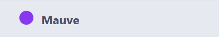

## 仓库链接

<https://github.com/Jy-EggRoll/my-keymap/>

## 使用方法

将本仓库中 `data` 目录中各子文件放入 MyKeymap 的 `data` 目录下即可，之后各个函数可以根据您的需要被 MyKeymap 调用。

> [!WARNING]
>
> 如果您不希望自己的设置被覆盖为我的设置，请勿替换 `config.json` 文件。
>
> 本仓库的 `config.json` 旨在提供实例配置，事实上这就是我本人的 MyKeymap 配置。您可以备份您自己的配置文件，直接使用我的配置文件或者以文本形式复制特定片段，以简化您的配置。
>
> 值得注意的是，我的使用习惯和 MyKeymap 的默认配置已经大相径庭，如果您直接使用我的配置文件，可能会不适应或感到功能缺失，所以复制特定片段加入您自己的配置文件的方式是推荐的做法。

`custom_function.ahk` 仅保留和官方一样的接口，负责导入各个模块，本身不提供任何实际功能，所以如果希望体验全部功能，请加入全部的 ahk 文件。

## 引言

使用 [MyKeymap](https://github.com/xianyukang/MyKeymap) 已经有相当长一段时间了，学习了一部分 [AutoHotkey](https://github.com/AutoHotkey/AutoHotkey) 后，我现在可以开发一些额外的功能。目前，这些脚本全部无需依赖 MyKeymap，可以直接由 AHK 调用。

不过，值得注意的是，通过 MyKeymap 的强大扩展能力来使用我的函数是最佳实践。我的所有函数均未分配快捷键，若您需要直接通过 AHK 调用，请自行修改代码分配快捷键。

## 自定义函数表

> [!TIP]
>
> 若您在手机端或较窄的 GitHub 页面上浏览此节，为了更舒适的阅读体验，请跳转至我的博客查看函数表（GitHub 不支持自定义 CSS 的表格，这会导致表格超出屏幕，排版也不美观）。文章剩余部分也是一致的，您可以直接继续浏览全文。链接如下：
>
> <https://eggroll.pages.dev/p/%E9%A1%B9%E7%9B%AE%E4%BB%8B%E7%BB%8Dmy-keymap/#%E8%87%AA%E5%AE%9A%E4%B9%89%E5%87%BD%E6%95%B0%E8%A1%A8>

<table style="width: 100%; border-collapse: collapse; table-layout: fixed;">
  <thead>
    <tr>
      <th style="width: 25%; padding: 10px; border: 2px solid; text-align: center;">函数名</th>
      <th style="width: 25%; padding: 10px; border: 2px solid; text-align: center;">参数说明</th>
      <th style="width: 25%; padding: 10px; border: 2px solid; text-align: center;">功能</th>
      <th style="width: 25%; padding: 10px; border: 2px solid; text-align: center;">最佳实践</th>
    </tr>
  </thead>
  <tbody>
    <tr>
      <td style="padding: 10px; border: 2px solid; overflow-wrap: anywhere;">DragWindow()</td>
      <td style="padding: 10px; border: 2px solid; overflow-wrap: anywhere;">无参数</td>
      <td style="padding: 10px; border: 2px solid; overflow-wrap: anywhere;">直接拖动任意窗口（无需点击标题栏），如果是最大化窗口，该窗口将会被还原为上一个非最大化状态</td>
      <td style="padding: 10px; border: 2px solid; overflow-wrap: anywhere;">绑定到前置键+鼠标左键，例如 <kbd>Caps</kbd> + 鼠标左键</td>
    </tr>
    <tr>
      <td style="padding: 10px; border: 2px solid; overflow-wrap: anywhere;">ResizeWindow()</td>
      <td style="padding: 10px; border: 2px solid; overflow-wrap: anywhere;">无参数</td>
      <td style="padding: 10px; border: 2px solid; overflow-wrap: anywhere;">直接调整任意窗口的大小（无需定位到边框），窗口会被划分为 9 个区域，拖动对应区域即可完成调节，如果是最大化窗口，该窗口将会被还原为上一个非最大化状态</td>
      <td style="padding: 10px; border: 2px solid; overflow-wrap: anywhere;">绑定到前置键+鼠标右键，例如 <kbd>Caps</kbd> + 鼠标右键</td>
    </tr>
    <tr>
      <td style="padding: 10px; border: 2px solid; overflow-wrap: anywhere;">PerCenterAndResizeWindow(percentageW, percentageH)</td>
      <td style="padding: 10px; border: 2px solid; overflow-wrap: anywhere;">小数，宽度占屏幕的比例（0-1），高度占屏幕的比例（0-1）</td>
      <td style="padding: 10px; border: 2px solid; overflow-wrap: anywhere;">调整窗口大小并居中，智能适应不同分辨率屏幕</td>
      <td style="padding: 10px; border: 2px solid; overflow-wrap: anywhere;">自定义快捷键</td>
    </tr>
    <tr>
      <td style="padding: 10px; border: 2px solid; overflow-wrap: anywhere;">Per*AndResizeWindow(percentageW, percentageH)</td>
      <td style="padding: 10px; border: 2px solid; overflow-wrap: anywhere;">小数，宽度占屏幕的比例（0-1），高度占屏幕的比例（0-1）</td>
      <td style="padding: 10px; border: 2px solid; overflow-wrap: anywhere;">* 替换为 Left、Down、Right、Up、LeftUp、LeftDown、RightUp、RightDown，负责分屏和边角</td>
      <td style="padding: 10px; border: 2px solid; overflow-wrap: anywhere;">前四个功能完全替换默认的 <kbd>Win</kbd> + 方向键，后四个替换为合适的快捷键</td>
    </tr>
    <tr>
      <td style="padding: 10px; border: 2px solid; overflow-wrap: anywhere;">SplitScreen(gridNum, gridIndex)</td>
      <td style="padding: 10px; border: 2px solid; overflow-wrap: anywhere;">gridNum：网格数量，gridIndex：实际位置</td>
      <td style="padding: 10px; border: 2px solid; overflow-wrap: anywhere;">描述较长，见下文，该函数是对上面两个函数的进一步封装</td>
      <td style="padding: 10px; border: 2px solid; overflow-wrap: anywhere;">使用 MyKeymap 的命令实现分屏，如 41、92</td>
    </tr>
    <tr>
      <td style="padding: 10px; border: 2px solid; overflow-wrap: anywhere;">AutoActivateWindow(pollingTime := 50)</td>
      <td style="padding: 10px; border: 2px solid; overflow-wrap: anywhere;">pollingTime：轮询时间，默认为 50 ms</td>
      <td style="padding: 10px; border: 2px solid; overflow-wrap: anywhere;">开关函数，未启动时调用则启动，已启动调用则停止，默认随 MyKeymap 启动</td>
      <td style="padding: 10px; border: 2px solid; overflow-wrap: anywhere;">绑定一个快捷键或一个指令，方便随时启停</td>
    </tr>
    <tr>
      <td style="padding: 10px; border: 2px solid; overflow-wrap: anywhere;">IncBrightness(dealt)</td>
      <td style="padding: 10px; border: 2px solid; overflow-wrap: anywhere;">整数，一个百分比值，如 5</td>
      <td style="padding: 10px; border: 2px solid; overflow-wrap: anywhere;">增加屏幕亮度，默认为 1 号显示器，每次 MyKeymap 启动重置为 1 号显示器</td>
      <td style="padding: 10px; border: 2px solid; overflow-wrap: anywhere;">自定义为合适的快捷键或指令</td>
    </tr>
    <tr>
      <td style="padding: 10px; border: 2px solid; overflow-wrap: anywhere;">DecBrightness(dealt)</td>
      <td style="padding: 10px; border: 2px solid; overflow-wrap: anywhere;">整数，一个百分比值，如 5</td>
      <td style="padding: 10px; border: 2px solid; overflow-wrap: anywhere;">降低屏幕亮度，默认为 1 号显示器，每次 MyKeymap 启动重置为 1 号显示器</td>
      <td style="padding: 10px; border: 2px solid; overflow-wrap: anywhere;">自定义为合适的快捷键或指令</td>
    </tr>
    <tr>
      <td style="padding: 10px; border: 2px solid; overflow-wrap: anywhere;">NextMonitor()</td>
      <td style="padding: 10px; border: 2px solid; overflow-wrap: anywhere;">无参数</td>
      <td style="padding: 10px; border: 2px solid; overflow-wrap: anywhere;">调整下一个显示器的亮度，只要 MyKeymap 不重启，当前被调节的显示器就不会再改变，直到触发该函数</td>
      <td style="padding: 10px; border: 2px solid; overflow-wrap: anywhere;">自定义为合适的快捷键或指令</td>
    </tr>
    <tr>
      <td style="padding: 10px; border: 2px solid; overflow-wrap: anywhere;">PreviousMonitor()</td>
      <td style="padding: 10px; border: 2px solid; overflow-wrap: anywhere;">无参数</td>
      <td style="padding: 10px; border: 2px solid; overflow-wrap: anywhere;">调整上一个显示器的亮度，只要 MyKeymap 不重启，当前被调节的显示器就不会再改变，直到触发该函数</td>
      <td style="padding: 10px; border: 2px solid; overflow-wrap: anywhere;">自定义为合适的快捷键或指令</td>
    </tr>
    <tr>
      <td style="padding: 10px; border: 2px solid; overflow-wrap: anywhere;">AutoWindowColorBorder()</td>
      <td style="padding: 10px; border: 2px solid; overflow-wrap: anywhere;">无参数</td>
      <td style="padding: 10px; border: 2px solid; overflow-wrap: anywhere;">开关函数，未启动时调用则启动，已启动调用则停止，默认随 MyKeymap 启动</td>
      <td style="padding: 10px; border: 2px solid; overflow-wrap: anywhere;">绑定一个快捷键或一个指令，方便随时启停</td>
    </tr>
    <tr>
      <td style="padding: 10px; border: 2px solid; overflow-wrap: anywhere;">SwitchToNextColor()</td>
      <td style="padding: 10px; border: 2px solid; overflow-wrap: anywhere;">无参数</td>
      <td style="padding: 10px; border: 2px solid; overflow-wrap: anywhere;">切换到下一个边框颜色，达到最后一个则循环到第一个，颜色列表请在代码中自定义</td>
      <td style="padding: 10px; border: 2px solid; overflow-wrap: anywhere;">自定义为合适的快捷键或指令</td>
    </tr>
  </tbody>
</table>

## 额外说明

### 拖动与调节 DragWindow & ResizeWindow

两款函数核心功能受 [AltSnap](https://github.com/RamonUnch/AltSnap) 启发，实现上参考了 AHK 官方的示例脚本。

### 比例居中 PerCenterAndResizeWindow

针对官方函数“硬编码像素值（如 800 × 600）”的小缺陷，该函数通过“比例参数”实现智能适配不同分辨率的屏幕，实现视觉效果的统一。

### 分屏拓展函数 SplitScreen

根据指定的网格数量和网格索引，将当前活动窗口调整到屏幕对应位置并设置相应大小，支持多种分屏布局（2 格、3 格、4 格、9 格），不同网格数量对应不同的屏幕分割方式。

@param {number} gridNum - 网格数量，决定分屏布局模式，支持的值：2、3、4、9

2：两格布局，支持水平分割（h1 左半屏、h2 右半屏）和垂直分割（v1 上半屏、v2 下半屏）

3：三格布局，支持水平分割（h1 左 1/3、h2 中 1/3、h3 右 1/3）和垂直分割（v1 上 1/3、v2 中 1/3、v3 下 1/3）

4：四格布局（2 * 2 网格），索引 1-4 分别对应左上、右上、左下、右下

9：九格布局（3 * 3 网格），索引 1-9 对应从左上到右下的 3 * 3 网格位置

@param {number|string} gridIndex - 网格索引，标识窗口在当前网格布局中的位置

当 gridNum 为 4 或 9 时，取值为数字 1-4 或 1-9，对应网格中的具体位置

当 gridNum 为 2 时，取值为字符串 "h1"、"h2"（水平分割）或 "v1"、"v2"（垂直分割）

当 gridNum 为 3 时，取值为字符串 "h1"、"h2"、"h3"（水平分割）或 "v1"、"v2"、"v3"（垂直分割）

### 自动激活窗口 AutoActivateWindow

解决“激活窗口的心智负担”：鼠标悬停处自动激活窗口，无需纠结“点链接会误触、点资源管理器怕选到文件、点代码编辑器会改变输入焦点”。

- **用户行为识别**：仅当鼠标 **移动后再静置 500 ms 以上且移动范围超过 100 * 100 px 时** 激活窗口，鼠标移动过程中绝不触发，鼠标一直静止时绝不触发。效果如下：
  - 纯鼠标操作：较灵敏，又不至于移动时误触发，500 ms 使用户有充足的容错时间
  - 纯键盘操作：完全不触发自动激活
  - 在软件内点击某超链接，跳出了某窗口，但是鼠标没有大范围移动时，不会导致误触发
- **全场景兼容**：内置了完善的判断逻辑，桌面、浏览器、文件资源管理器和开始菜单中的右键菜单都不会被识别为窗口并误激活，功能十分稳定。

### 亮度调节 IncBrightness & DecBrightness

不显示调节界面，更加沉浸。功能与 MyKeymap 自带的一致。由于不显示 GUI，显示器状态状态变化时（如插入了外接显示器）需要重启 MyKeymap，以保证功能正常（当状态变化时，尝试调用该功能会自动出现提示）。

### 活动窗口边框着色 AutoWindowColorBorder

> [!WARNING]
>
> 此功能依赖于 Windows 11 API，在 Windows 10 上完全无效。

Windows 11 自带类似功能，其效果实在不能令人满意。对于第三方软件，更是常常出现失效的情况，比如微信就无法享受该效果。

我使用 AHK 调用系统核心 API，实现了该效果，对第三方软件兼容性极佳，效果也很好。

该功能默认随 MyKeymap 启动，和自动激活窗口相辅相成，为识别激活的窗口又多了一层保障。

效果预览：

如果颜色不合适，请使用 SwitchToNextColor() 来切换颜色，颜色列表在代码中自定义。目前颜色可以随着系统主题自动变更，深色主题对应无后缀列表，浅色主题对应 Mode2 列表。两种模式的默认边框颜色分别如下：

> [!TIP]
>
> 已有的颜色边框，其颜色不会立即随着系统主题变更而刷新。颜色列表会在主题变更后第一次创建着色边框时刷新。换言之，如果想要在修改系统主题色后立即看到当前应用的边框色的更改，请令其失去焦点再获得焦点。

## 关于作者

个人网站：<https://eggroll.pages.dev/>

也欢迎浏览作者在 GitHub 上的其他项目。

祝您使用愉快。
